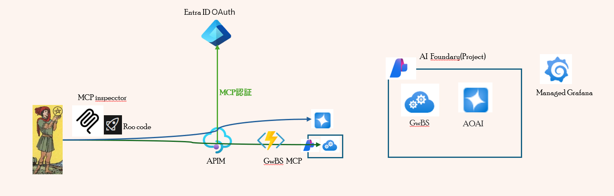
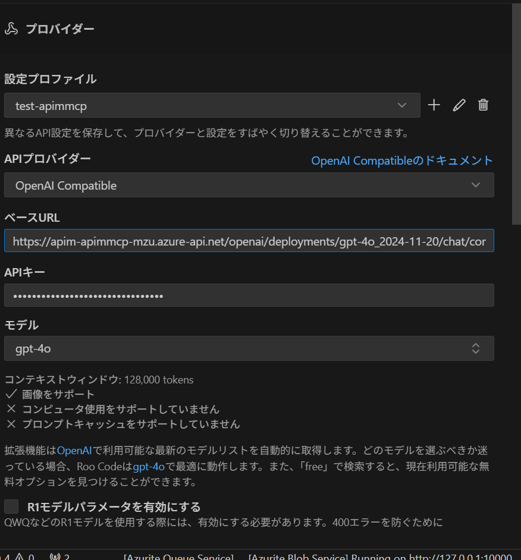

# AOAI×Bing Search MCP の API 公開

近年、プラットフォームエンジニアリングの分野では生成 AI の活用が広がっています。  
本プロジェクトは、Azure OpenAI Service と Bing Search MCP を API として公開するサンプル構成を提供します。

## 構成概要



詳細な構成については、[こちらの資料](https://www.docswell.com/s/windagecat/Z2N339-2025-07-26-165303)をご参照ください。

---

## デプロイ手順

### パラメータ設定

1. `infra/variables.tf` で必要な変数（location, environment_name, subscription_id, openai, bingsearch_ai など）を確認します。
2. `infra/main.tfvars.json` を編集し、各変数値を設定します。

   - **`${openai.model.model}`は、必ずチャット完了(chat-completion)に対応したモデル**を指定してください。
   - 下記 3 つの変数は、**必ず `${AZURE_LOCATION}` `${AZURE_ENV_NAME}` `${AZURE_SUBSCRIPTION_ID}` のまま記載してください。**
     - `"location": "${AZURE_LOCATION}"`
     - `"environment_name": "${AZURE_ENV_NAME}"`
     - `"subscription_id": "${AZURE_SUBSCRIPTION_ID}"`

   **設定例:**

   ```json
   {
     "location": "${AZURE_LOCATION}",
     "environment_name": "${AZURE_ENV_NAME}",
     "subscription_id": "${AZURE_SUBSCRIPTION_ID}",
     "openai": {
       "locations": ["canadaeast", "swedencentral"],
       "model": {
         "model": "gpt-4o",
         "version": "2024-11-20",
         "deploytype": "Standard",
         "capacity": 48
       }
     },
     "bingsearch_ai": {
       "location": "westus",
       "model": {
         "model": "gpt-4.1-nano",
         "version": "2025-04-14",
         "format": "OpenAI",
         "deploytype": "GlobalStandard",
         "capacity": 47
       }
     }
   }
   ```

### デプロイ実行

以下のコマンドを実行します。

```bash
azd up
```

---

### Grafana による可視化ダッシュボードの Terraform 適用（任意）

Grafana による可視化ダッシュボードはオプションです。興味がある方は以下を実行してください。

1. 環境変数 `GRAFANA_AUTH` のセット

   ```bash
   # <GRAFANA_WORKSPACE_NAME>は、azd upで出力された Grafana ワークスペース名を指定してください。
   az grafana service-account create \
     --name <GRAFANA_WORKSPACE_NAME> \
     --service-account "api" \
     --role Admin

   export GRAFANA_AUTH=$(az grafana service-account token create \
     --name <GRAFANA_WORKSPACE_NAME> \
     --service-account "api" \
     --token "token" --time-to-live 7d \
     --query key -o tsv)
   ```

2. デプロイ実行

   ```bash
   cd gra_tf
   terraform init
   terraform apply
   ```

   > `terraform.tfvars` は「azd up」実行時に出力済みです。

---

## AOAI×Bing Search MCP のテスト

### roo code を使った MCP テスト手順

1. **AI プロバイダーの設定**

   - ベース URL に「azd up」実行時に出力された `SERVICE_AOAI_ENDPOINTS` を指定します。
   - モデルは `infra/main.tfvars.json` で設定したものを選択してください。
   - API キーには、**APIM のサブスクリプションキー**（Azure ポータル → APIM 名 → 製品 → 「sa ai api」で確認可能）を指定してください。

   

2. **MCP サーバー設定例**

   ```json
   {
     "servers": {
       "bingsearch-server": {
         "type": "sse",
         "url": "<出力されたSERVICE_BINGSEARCHMCP_ENDPOINTS>",
         "headers": {
           "Ocp-Apim-Subscription-Key": "<1.と同じAPIMのサブスクリプションキー>"
         },
         "timeout": 300
       }
     }
   }
   ```

3. チャット画面で「現在 1 ドルいくらですか」と入力し、実行

---

### MCP Inspector を利用した Oauth MCP テストの実行

1. MCP Inspector をインストールして実行

   ```bash
   npx @modelcontextprotocol/inspector
   ```

2. 表示された URL（例：http://localhost:6274/?MCP_PROXY_AUTH_TOKEN=xxxxxx）から MCP Inspector にアクセス
3. トランスポートタイプを `SSE` に設定
4. `azd up` の出力に表示された API Management SSE エンドポイントの URL (`SERVICE_OAUTH_BINGSEARCHMCP_ENDPOINTS`) を設定し、**Connect**
5. **List Tools**タブの中からツールを選択し、**Run Tool**をクリック
